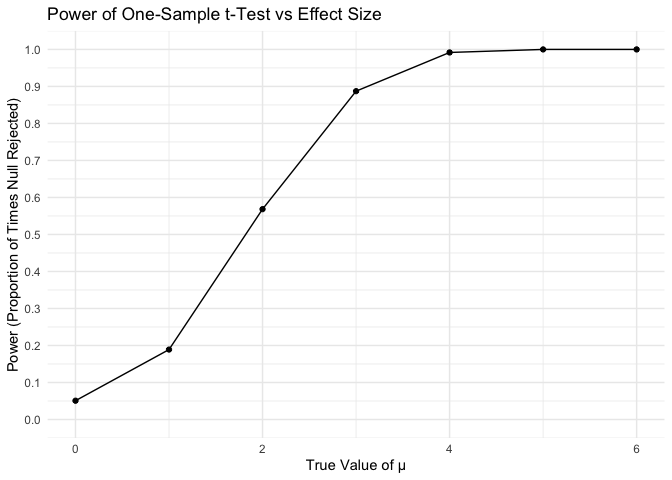
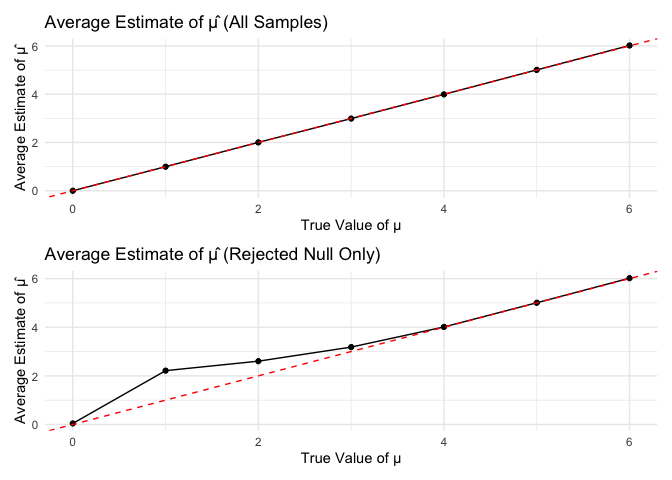
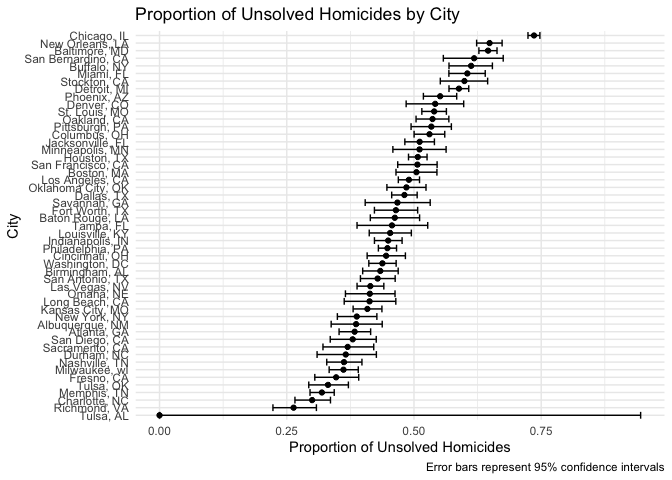

p8105_hw5_JR4550
================
Jeff Remo
2025-11-15

## set up environment

``` r
library(tidyverse)
library(rvest)
library(broom)
library(purrr)
```

## Problem 2

Create function

``` r
set.seed(1)

sim_t_test = function(n = 30, mu, sigma = 5) {
  x = rnorm(n, mean = mu, sd = sigma)
    test_result = t.test(x, mu = 0) %>%
    tidy() %>%
    select(estimate, p.value)
  
  test_result
}
```

#### Simulation for mu

``` r
sim_results_all = 
  tibble(
    true_mu = c(0:6)
  ) %>%
  mutate(
    results = map(true_mu, ~rerun(5000, sim_t_test(mu = .x)))
  ) %>%
  unnest(results) %>%
  mutate(
    iteration = rep(1:5000, times = 7)
  ) %>%
  unnest(results)
```

    ## Warning: There was 1 warning in `mutate()`.
    ## ℹ In argument: `results = map(true_mu, ~rerun(5000, sim_t_test(mu = .x)))`.
    ## Caused by warning:
    ## ! `rerun()` was deprecated in purrr 1.0.0.
    ## ℹ Please use `map()` instead.
    ##   # Previously
    ##   rerun(5000, sim_t_test(mu = .x))
    ## 
    ##   # Now
    ##   map(1:5000, ~ sim_t_test(mu = .x))

``` r
power_results = 
  sim_results_all %>%
  group_by(true_mu) %>%
  summarize(
    power = mean(p.value < 0.05)
  )
```

#### Plot 1 Power Results

``` r
power_results %>%
  ggplot(aes(x = true_mu, y = power)) +
  geom_line() +
  geom_point() +
  labs(
    title = "Power of One-Sample t-Test vs Effect Size",
    x = "True Value of μ",
    y = "Power (Proportion of Times Null Rejected)"
  ) +
  theme_minimal() +
  scale_y_continuous(limits = c(0, 1), breaks = seq(0, 1, 0.1))
```

<!-- -->

``` r
avg_estimates = 
  sim_results_all %>%
  group_by(true_mu) %>%
  summarize(
    avg_estimate_all = mean(estimate),
    avg_estimate_rejected = mean(estimate[p.value < 0.05])
  )
```

#### Association of Size and Power:

The plot shows a strong positive link between effect size and power.
When μ = 0 (no effect), power is about 0.05, the same as α (the Type I
error rate). As the effect size gets bigger, power goes up quickly. When
μ = 4, power is close to 1, so we almost always find the true effect.
This means it’s easier to spot larger effect sizes with the same sample
size and variance.

#### Plot 2 All samples

``` r
p1 = avg_estimates %>%
  ggplot(aes(x = true_mu, y = avg_estimate_all)) +
  geom_line() +
  geom_point() +
  geom_abline(intercept = 0, slope = 1, linetype = "dashed", color = "red") +
  labs(
    title = "Average Estimate of μ̂ (All Samples)",
    x = "True Value of μ",
    y = "Average Estimate of μ̂"
  ) +
  theme_minimal()
```

# Plot 3: Rejected null only

``` r
p2 = avg_estimates %>%
  ggplot(aes(x = true_mu, y = avg_estimate_rejected)) +
  geom_line() +
  geom_point() +
  geom_abline(intercept = 0, slope = 1, linetype = "dashed", color = "red") +
  labs(
    title = "Average Estimate of μ̂ (Rejected Null Only)",
    x = "True Value of μ",
    y = "Average Estimate of μ̂"
  ) +
  theme_minimal()
```

``` r
library(patchwork)
p1 / p2
```

<!-- -->

``` r
print("Power by True μ:")
```

    ## [1] "Power by True μ:"

``` r
print(power_results)
```

    ## # A tibble: 7 × 2
    ##   true_mu  power
    ##     <int>  <dbl>
    ## 1       0 0.0508
    ## 2       1 0.189 
    ## 3       2 0.568 
    ## 4       3 0.887 
    ## 5       4 0.992 
    ## 6       5 1     
    ## 7       6 1

``` r
print("\nAverage Estimates:")
```

    ## [1] "\nAverage Estimates:"

``` r
print(avg_estimates)
```

    ## # A tibble: 7 × 3
    ##   true_mu avg_estimate_all avg_estimate_rejected
    ##     <int>            <dbl>                 <dbl>
    ## 1       0        -0.000262                0.0426
    ## 2       1         0.996                   2.21  
    ## 3       2         2.00                    2.60  
    ## 4       3         2.99                    3.18  
    ## 5       4         3.99                    4.01  
    ## 6       5         5.01                    5.01  
    ## 7       6         6.02                    6.02

#### Is the sample average of 𝜇̂ across tests for which the null is rejected approximately equal to the true value of 𝜇? Why or why not?

No, not always. When considering all samples, the average estimate
equals the true μ because μ̂ is unbiased. However, among only the samples
where the null was rejected, the average estimate is larger than the
true μ for small effect sizes. This happens because when power is low,
we only reject the null when we get unusually large sample estimates,
creating selection bias. As the true effect size increases and power
approaches 1, this bias disappears because we reject the null in nearly
all samples.

## Problem 3

Load and Describe data

``` r
homicide_df =
  read_csv("data/homicide-data.csv", na = c("NA", ".", "")) |> 
  janitor::clean_names()
```

    ## Rows: 52179 Columns: 12
    ## ── Column specification ────────────────────────────────────────────────────────
    ## Delimiter: ","
    ## chr (9): uid, victim_last, victim_first, victim_race, victim_age, victim_sex...
    ## dbl (3): reported_date, lat, lon
    ## 
    ## ℹ Use `spec()` to retrieve the full column specification for this data.
    ## ℹ Specify the column types or set `show_col_types = FALSE` to quiet this message.

``` r
glimpse(homicide_df)
```

    ## Rows: 52,179
    ## Columns: 12
    ## $ uid           <chr> "Alb-000001", "Alb-000002", "Alb-000003", "Alb-000004", …
    ## $ reported_date <dbl> 20100504, 20100216, 20100601, 20100101, 20100102, 201001…
    ## $ victim_last   <chr> "GARCIA", "MONTOYA", "SATTERFIELD", "MENDIOLA", "MULA", …
    ## $ victim_first  <chr> "JUAN", "CAMERON", "VIVIANA", "CARLOS", "VIVIAN", "GERAL…
    ## $ victim_race   <chr> "Hispanic", "Hispanic", "White", "Hispanic", "White", "W…
    ## $ victim_age    <chr> "78", "17", "15", "32", "72", "91", "52", "52", "56", "4…
    ## $ victim_sex    <chr> "Male", "Male", "Female", "Male", "Female", "Female", "M…
    ## $ city          <chr> "Albuquerque", "Albuquerque", "Albuquerque", "Albuquerqu…
    ## $ state         <chr> "NM", "NM", "NM", "NM", "NM", "NM", "NM", "NM", "NM", "N…
    ## $ lat           <dbl> 35.09579, 35.05681, 35.08609, 35.07849, 35.13036, 35.151…
    ## $ lon           <dbl> -106.5386, -106.7153, -106.6956, -106.5561, -106.5810, -…
    ## $ disposition   <chr> "Closed without arrest", "Closed by arrest", "Closed wit…

The homicide dataset contains 52,179 observations and 12 variables
documenting homicide cases across 50 U.S. cities. Each row represents a
single homicide case with a unique identifier (uid). Key variables
include the reported date of the incident, victim demographics (name,
race, age, and sex), geographic information (city, state, lat, and
long), and case dispo indicating whether the case was closed by arrest,
closed without arrest, or remains open with no arrest.

``` r
homicide_summary = 
  homicide_df%>%
  mutate(
    city_state = str_c(city, ", ", state)
  ) %>%
  group_by(city_state) %>%
  summarize(
    total_homicides = n(),
    unsolved_homicides = sum(disposition %in% c("Closed without arrest", "Open/No arrest"))
  )

homicide_summary
```

    ## # A tibble: 51 × 3
    ##    city_state      total_homicides unsolved_homicides
    ##    <chr>                     <int>              <int>
    ##  1 Albuquerque, NM             378                146
    ##  2 Atlanta, GA                 973                373
    ##  3 Baltimore, MD              2827               1825
    ##  4 Baton Rouge, LA             424                196
    ##  5 Birmingham, AL              800                347
    ##  6 Boston, MA                  614                310
    ##  7 Buffalo, NY                 521                319
    ##  8 Charlotte, NC               687                206
    ##  9 Chicago, IL                5535               4073
    ## 10 Cincinnati, OH              694                309
    ## # ℹ 41 more rows

Prop test for Baltimore, MD

``` r
baltimore_data = 
  homicide_summary %>%
  filter(city_state == "Baltimore, MD")

baltimore_prop_test = 
  prop.test(
    x = baltimore_data %>% pull(unsolved_homicides),
    n = baltimore_data %>% pull(total_homicides)
  )
baltimore_tidy = 
  broom::tidy(baltimore_prop_test)

baltimore_result = 
  baltimore_tidy %>%
  select(estimate, conf.low, conf.high)

baltimore_result
```

    ## # A tibble: 1 × 3
    ##   estimate conf.low conf.high
    ##      <dbl>    <dbl>     <dbl>
    ## 1    0.646    0.628     0.663

Prop test all cities

``` r
all_cities_test = 
  homicide_summary %>%
  mutate(
    prop_test_result = purrr::map2(
      unsolved_homicides, 
      total_homicides,
      ~prop.test(.x, .y) %>% broom::tidy()
    )
  ) %>%
  unnest(prop_test_result) %>%
  select(city_state, estimate, conf.low, conf.high)
```

    ## Warning: There was 1 warning in `mutate()`.
    ## ℹ In argument: `prop_test_result = purrr::map2(...)`.
    ## Caused by warning in `prop.test()`:
    ## ! Chi-squared approximation may be incorrect

``` r
all_cities_test
```

    ## # A tibble: 51 × 4
    ##    city_state      estimate conf.low conf.high
    ##    <chr>              <dbl>    <dbl>     <dbl>
    ##  1 Albuquerque, NM    0.386    0.337     0.438
    ##  2 Atlanta, GA        0.383    0.353     0.415
    ##  3 Baltimore, MD      0.646    0.628     0.663
    ##  4 Baton Rouge, LA    0.462    0.414     0.511
    ##  5 Birmingham, AL     0.434    0.399     0.469
    ##  6 Boston, MA         0.505    0.465     0.545
    ##  7 Buffalo, NY        0.612    0.569     0.654
    ##  8 Charlotte, NC      0.300    0.266     0.336
    ##  9 Chicago, IL        0.736    0.724     0.747
    ## 10 Cincinnati, OH     0.445    0.408     0.483
    ## # ℹ 41 more rows

Unsolved Homicides plot

``` r
all_cities_test %>%
  mutate(
    city_state = fct_reorder(city_state, estimate)
  ) %>%
  ggplot(aes(x = city_state, y = estimate)) +
  geom_point() +
  geom_errorbar(aes(ymin = conf.low, ymax = conf.high)) +
  coord_flip() +
  labs(
    title = "Proportion of Unsolved Homicides by City",
    x = "City",
    y = "Proportion of Unsolved Homicides",
    caption = "Error bars represent 95% confidence intervals"
  ) +
  theme_minimal()
```

<!-- -->
